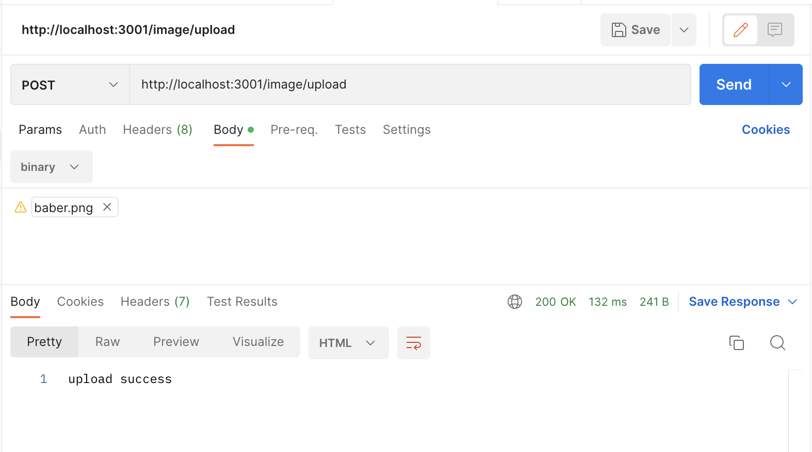

# Simple Web Image example

> A example project to show how to use the [Simple Web Image](http://github.com/tuanvu0995/simple-web-image) library.

## Prerequisites

This project requires NodeJS (version 14 or later) and NPM. Node and NPM are really easy to install. To make sure you have them available on your machine, try running the following command.

## Usage

Clone the project and install the dependencies.

```bash

git clone https://github.com/tuanvu0995/swi-example.git
npm install

```

Run the project.

```bash

cp .env.example .env
npm run dev
```

## Test

Using post man to send a `POST` request to server with `binary` image data in body.




## License

[MIT License](LICENSE) © Vu Lai
